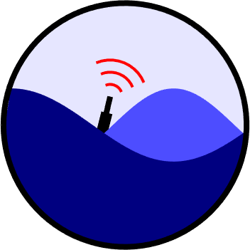

# **AXBT Realtime Editing System (ARES)**


**Authors: Casey Densmore (cdensmore101@gmail.com) and Matt Kuhn**



<b>No further development is being completed on this repository. ARES has been superseded by the Airborne eXpendable Buoy Processing System (AXBPS), which includes the AXBT processing capabilities of this software and additional airborne-expendable probe support, along with a significant amount of code refactoring and optimization compared to this repository. This repository is located at [https://github.com/cdens/axbps](https://github.com/cdens/axbps)</b> 


## Overview <a id="overview"></a>
The AXBT Realtime Editing System (ARES) is a software/hardware system capable of receiving and quality controlling Airborne eXpendable BathyThermograph (AXBT) profiles. ARES is composed of two independent subsystems: the ARES Data Acquisition System, which receives telemetered temperature-depth profiles with no external hardware other than a VHF radio receiver, and the ARES Profile Editing System, which quality controls AXBT temperature-depth profiles.

The AXBT Realtime Editing System (ARES) Data Acquisition System is designed to receive pulse code modulated (PCM) audio data containing an AXBT signal and produce a viable temperature-depth profile from that data. ARES is compatible with WiNRADIO software-defined radio receivers, which demodulate a VHF signal transmitted from an AXBT and exporting the resulting PCM data to ARES for processing. Additionally, previously recorded WAV files can be imported into ARES to generate a temperature-depth profile. ARES integrates the signal processing capabilities of the MK-21 or similar hardware and audio recorders as software-defined functions, reducing the equipment necessary to launch and process data from AXBTs. 

The AXBT Realtime Editing System (ARES) Profile Editing System is meant to enable users to quality control AXBT temperature-depth profiles, guided by an automated quality control algorithm and further aided by climatology and bathymetry data for the region of interest to reduce the background oceanographic knowledge necessary on the part of the user. 

ARES also comes with a mission planner feature, enabling users to overlay land masses, bathymetry contours, current position, and additional annotated shapes to identify ideal expendable probe drop locations.


## Platform Support
ARES is currently only fully functional in Windows as there is currently
no driver support for WiNRADIO G39WSBE Receivers in Linux or MacOS. All functionalities other than realtime data processing (e.g. audio file reprocessing, profile quality control) are available for Windows, Linux, and MacOS.

To obtain full (including realtime processing) support in Linux or MacOS, ARES can be installed on a Windows 10 virtual machine. ARES has been successfully tested for realtime processing in both VirtualBox and VMWare virtual machines with Windows 10 guest and Linux or MacOS host.


## Python requirements/dependencies
This program was developed in Python 3.6, with the GUI built using PyQt5.

	
### Installing Dependencies:
Windows: `pip install -r requirements.txt`  
Linux/MacOs: `pip3 install -r requirements.txt`

NOTE: You may need to install the libgeos library (e.g. *brew install libgeos* on MacOS) for Shapely to work, as well as the Proj library (e.g. *brew install proj* on MacOS) for Cartopy. On Windows, python modules with all dependencies can be installed from wheel files downloadable at https://www.lfd.uci.edu/~gohlke/pythonlibs

Using the Shapely module as an example, the file should be named Shapely-1.6.4.post2-cp3x-cp3xm-win(32 or _amd64).whl depending on Python version and windows type (e.g. Shapely-1.6.4.post2-cp37-cp37m-win_amd64.whl for Python v3.7, Windows x64-bit). After downloading the correct file, install following the syntax below:

```
pip install Shapely-1.6.4.post2-cp3x-cp3xm-win(32 or _amd64).whl 
```


## Data Dependencies and Additional Information

ARES also requires driver and data files in the qcdata folder and test files in the testdata folder. Due to size constraints, these are not included in the repository but are instead available in a compressed folder at http://mmmfire.whoi.edu/ares/. 

This website also hosts a the user manual with details on where to move these folders within the ARES repository, how to use ARES, operating principles, and a bundled version of ARES (with PyInstaller) and executable installer file for Windows 10 x64. 
